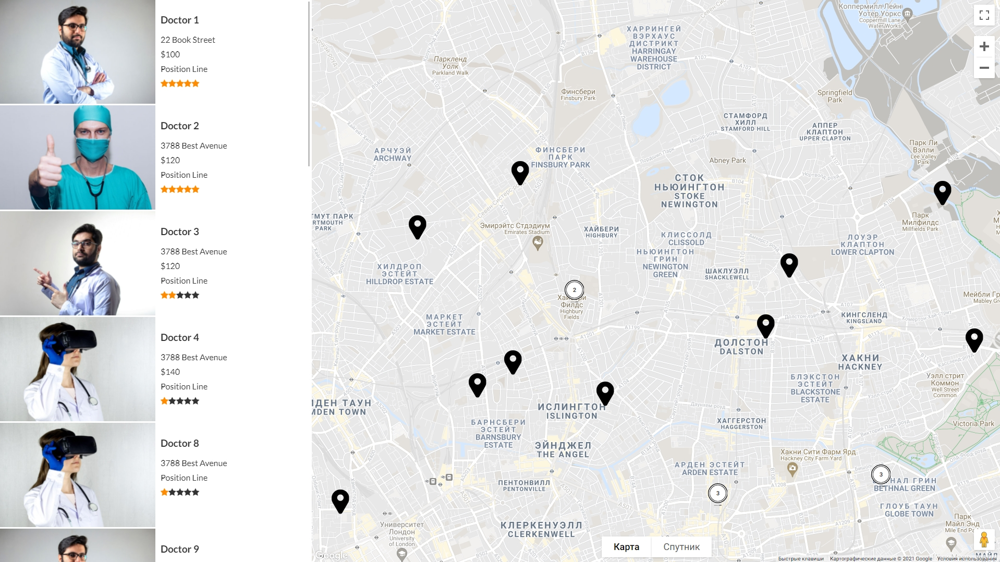

# Google Maps - Grouping and Clustering Markers

### Features:

- List View
- List dynamic updates when changing the position of the map view
- Info window for point
- Rating
- json items data

### Libs:
path - **/assets/js** </br>
**jquery.imageloader.js** - lets you have granular controls of image loading timing </br>
**infobox.js** - additional properties for advanced styling google.maps.InfoWindow </br>
**leaflet.js** - a JavaScript library for interactive maps </br>
**leaflet.markercluster.js** - Provides Beautiful Animated Marker Clustering functionality for Leaflet, a JS library for interactive maps. </br>
**richmarker.js** - A RichMarker that allows any HTML/DOM to be added to a map and be draggable. </br>
**markerclustererplus.js** - The library creates and manages per-zoom-level clusters for large amounts of markers. </bR>

### Markers for list view and map:
path - **/assets/json/items.js** </br>
Structure data: </br>
```
{
    "id": 22,
    "title": "Doctor 22",
    "location": "63 Birch Street",
    "latitude": 51.530189,
    "longitude": -0.078750,
    "url": "#",
    "type": "Position Line",
    "type_icon": "assets/img/marker.png",
    "rating": 4,
    "price": "$50",
    "gallery": [
        "assets/img/doctor3.jpg"
    ]
}
```

**id** - unique ID </br>
**title** - main title </br>
**location** - point location </br>
**latitude** - geo latitude </br>
**longitude** - geo longitude </br>
**url** - link to item (single item page) </br>
**type** - doctor position or some additional data </br>
**type_icon** - icon on map </br>
**rating** - item rating </br>
**price** - cost of services </br>
**gallery** - images (adding only 1 image works now) </br>

### How to start:
1. Сlone repository
2. Register new google maps API key here: </br>
   https://developers.google.com/maps/documentation/javascript/get-api-key
3. replace the line [YOUR_KEY_HERE] in the index.html file with your key
4. Change data in file - **/assets/json/items.js**
5. Enjoy)

### Main Screen:



### Info Window:
